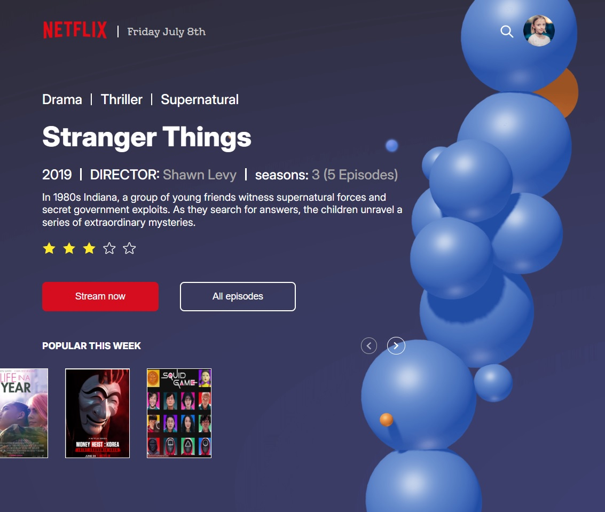

# Netflix Homepage

## Description

This project is a front-end clone of the Netflix homepage, developed using Vite, React, and TypeScript. It features modular CSS styles implemented with SCSS as a preprocessor. The design was made fully responsive, ensuring compatibility with all major device screen sizes, from desktops to tablets and mobile devices.

The goal was to recreate the design and functionality of Netflix's main page, showcasing responsiveness, modern UI/UX practices, clean code architecture, and reusable components.

## Technologies that have been used

- HTML5
- CSS3
- SCSS
- JAVASCRIPT (ES6+)
- TYPESCRIPT
- REACT
- GIT
- VITE

## Instructions for working with the project

1. Cloning a repository. You need to write `git clone https://github.com/boikoua/netflix_homepage` in terminal.

2. Go to the project folder `cd netflix_homepage`.

3. Check the node version. The version of node should be `v20.x.x`. To do this, type the command `node -v` in the terminal.

4. Install dependencies. To do this, enter the `npm install` command.

5. Run the project. To do this, enter the `npm run dev` command.
   After that the project will be available to you at `http://http://localhost:5173/`.

## View project

> Link to the project
> [DEMO LINK](https://boikoua.github.io/netflix_homepage/).

> Link to website layout in Figma
> [Netflix Homepage](<https://www.figma.com/file/p5lOe7ymTodeAuXuvCWZvm/Netflix_Homepage-(Community)?node-id=0%3A1>)

## Preview

